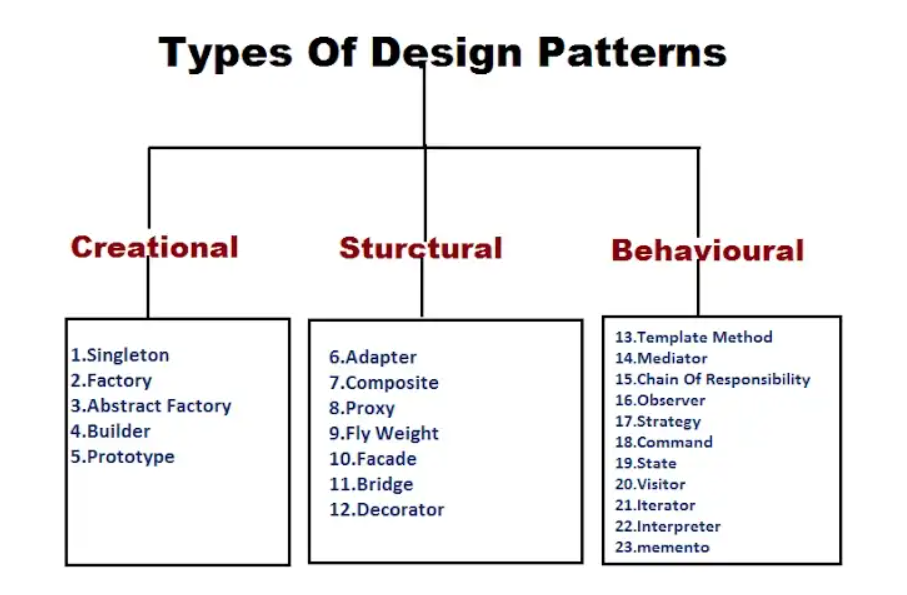

## How to Solve Countless Problems at once
 
With the rapid changes that our society undergoes continuously, the need to constantly learn new information is more important than ever. Coming up with ways to teach and learn new information efficiently is necessary to ensure that people can excel. One method of doing this is the use of design patterns. Design patterns are blueprints that can be used to describe problems that occur frequently, as well as describe the nature of the solution to this problem. Design patterns can be used to derive a solution for countless variations of the same problem. For example, imagine using a wheelbarrow, a wagon, and a dolly to move heavy or large objects. In this case, the wheelbarrow, wagon, and dolly would all be examples of specific solutions for their respective problems. They are not design patterns. In this example, the design pattern would be the use of a machine or device to move objects that you would have a difficult time moving on your own. In other words, a design pattern is not a specific solution to a specific problem, but rather an approach that can be used to come up with many solutions to variations of a generic problem. 

## Design Patterns in the World of code

In the world of coding, there are many different design patterns. These design patterns can generally be grouped into three categories: creational, structural, and behavioral. Creational patterns describe the methodology of the creation of new objects. One specific creational design pattern that I find myself using often in my code is the factory method. In this method, specific instances of an object are generated by a “factory.” This factory can be used to build different objects that all stem from a certain parent object. For example, a drink factory could be used to make instances of a coffee, tea, or soda class, which all fall under the generic parent class of drink. This gives much greater flexibility than making only one type of drink instance. Structural patterns describe how a collection of objects should be organized and composed within a larger structure. One example of a structural design pattern that I find useful is an adapter. An adapter can be used to convert data in one form to another that a client can use. For example, if a client only accepts list objects as input, an array can be passed to this data by using an adapter that changes arrays into lists. Lastly, behavioral design patterns are used to manage how objects interact with each other. One of the behavioral patterns that I use frequently in my code is the observer pattern. In this pattern, “observer” objects are informed of changes that occur in a “subject” object. For example, an online marketplace can send a notification to customers when new products are added to the marketplace. In this example, the marketplace is the subject, which changes state when the new products are added. The customers are the observers, which are notified of the change through the notification. 

In summary, design patterns are extremely helpful for solving frequently occurring problems, especially when it comes to coding. The use of design patterns will continue to help beginners learn quickly and effectively, without having to go through many of the pains of those that came before them. 

