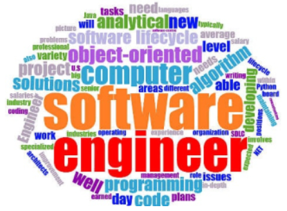

[Link to Image Source](https://www.ethicssage.com/2019/06/developing-a-code-of-ethics-for-software-engineers.html)

When people think of software engineering, they usually think of something like web development or making phone apps. Maybe they will think of cybersecurity or database management if they hear about all those data breaches in the news. While there is nothing wrong with any of those answers, there is far more depth to software engineering than "making a website" or "making a phone app." The fundamentals that make all of those possible are critical to the process of software engineering. Learning about these fundamentals has helped me to not only learn new programming languages and skills, but also to improve my understanding of how to approach challenging problems in the software engineering space. While there are many different fundamentals that are core to software engineering, I find ethics and project management to be among the most important. Our focus will be primarily on these two topics. 

## Ethics: not as Simple as Right and Wrong
 
Growing up, ethics were generally presented as black and white. There was always a morally “right” and morally “wrong” option in each situation. However, in reality there are often situations in which there is no clear “right” option. Software engineering is no exception. There are many situations in which a software engineer must make a choice between options with aspects that are both “right” and “wrong.” For example, imagine you are designing software for a driverless car. When given the choice, many people would probably choose to prioritize the lives of people above all else. However, what happens if the car is presented with a situation in which it must either injure a pedestrian or injure a passenger? The answer to this question is not so clear, and will vary depending on who you ask. Making a decision such as this one is something that software engineers may have to do in their development process. It is important for software engineers to carefully consider the benefits and drawbacks of their decisions, as they can possibly have large ramifications. 

## Agile Project Management: make Mountains into Molehills

For many, the term “project management” is not one that they are particularly fond of. Having to coordinate and compromise with others, attend pointless meetings, and rely on other people to be competent are among the many reasons that people dislike project management. Despite this, some form of project management is necessary for any project to keep everything organized, software or otherwise. One approach to project management that tries to make the process less painful is agile project management, where large projects are broken down into smaller problems or tasks. These tasks should not all be chronologically ordered, meaning that people should have tasks that they can work on in parallel. This way, people will not need to wait on others to begin their work. The type of agile project management that I am most familiar with is called issue driven project management. In issue driven project management, each person is responsible for at least one task that can be completed within a few days. While other people can help them work on a task, that person is ultimately responsible for its completion. Each of these tasks is documented as an issue and given a description. Every few days, a meeting is held to discuss the current progress on these issues and determine what the next set of issues will be. Every one to two weeks, some type of overarching goal should be reached. This process will repeat itself until the project is finished. 

As for my personal experiences with issue driven project management, I find that it does help with some aspects of group projects. Being able to work on something without needing someone to finish their part first makes progression faster. It also helps me keep track of who is responsible for each part of the project. However, there are aspects of issue driven project management that need some adjustment in my opinion. Having meetings and new tasks every few days might be too often or not often enough for certain projects. Additionally, having a form of group communication such as a text chat can help with addressing smaller problems that are not important enough to hold a meeting for. Relying solely on meetings for communication can lead to a lot of wasted time. With that said, issue driven project management is definitely better than having no project management, and it has helped me to better organize my project team. 

## Concluding Remarks

While there are many important fundamentals to software engineering, I consider ethics and project management to be among the most important because they can be applied to far more than just software engineering. Having an understanding of ethics and project management can help with work in almost any field, even ones that have nothing to do with software engineering. 

