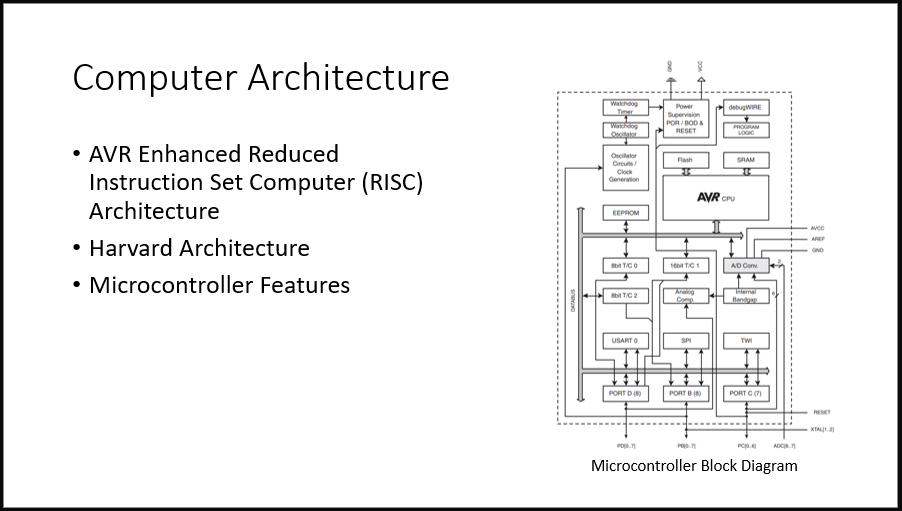

For this presentation my partner and I described the CPU architecture of the ATmega328P, a microcontroller commonly used in Arduino boards such as the Arduino Uno. We presented it to the rest of our EE 361L section via Discord. Our presentation was split into seven sections: introduction, computer architecture, CPU, memory, input/output, instruction set, and conclusion. I personally was responsible for the computer architecture, memory, and conclusion sections, as well as part of the instruction set section. An example of one of the slides I used for this presentation is shown below.

For the computer architecture section, I described the type of computer architecture that the ATmega328P is based on along with some of the features of the microcontroller. For the memory section, I explained how each memory space on the ATmega328P is organized. For the instruction set section, I briefly described the different categories of instructions that are used by the ATmega328P. The conclusion section covered closing remarks.

Sources for the images and information used in this presentation:
1. Microchip, “8-bit AVR Microcontroller with 32K Bytes In-System Programmable Flash,“ ATmega328P datasheet, Jan. 2015.
2. Microchip Technology Inc., AVR Instruction Set Manual, Microchip, 2021.
