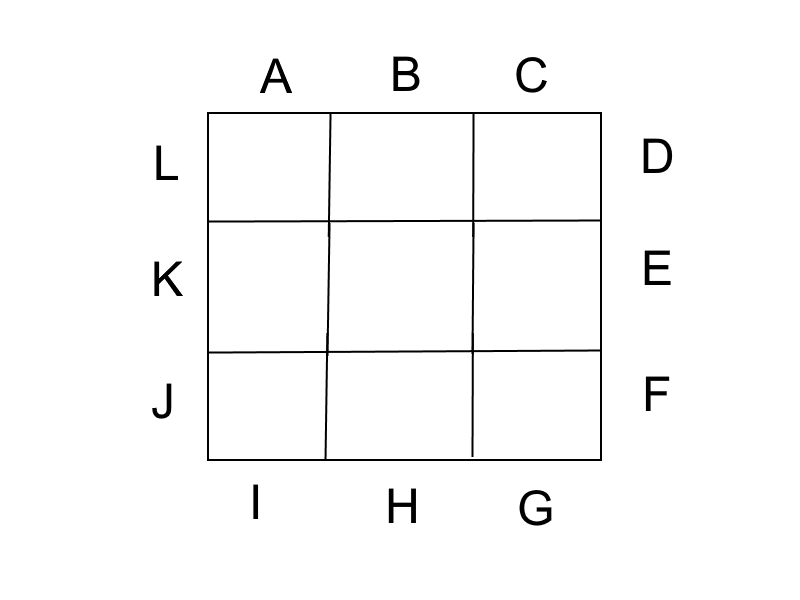
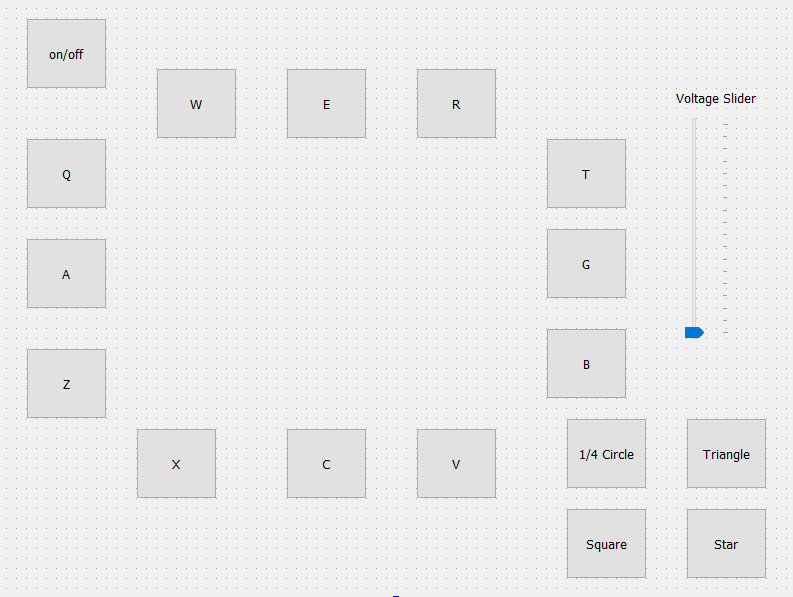

In recent years, the research into applications for liquid metal has greatly increased. Because of its reconfigurability and electrical properties, liquid metal may be a promising solution to the ever growing need for more powerful yet efficient electronic devices. This project largely focused on the movement of liquid metal inside a square pool filled with liquid. Electrodes placed on the perimeter of the pool would be used to control the liquid metal by applying different voltages across the pool. An example of how the electrodes would be set up is shown below, where each electrode is represented by a letter. 

For this project I worked on making predefined patterns for specific movements of a liquid metal droplet and developing the GUI we used to control the electrodes. Some of the predefined patterns I helped implement were square, triangle, and start patterns. The GUI was created using QT Creator, an IDE made for GUI application development. I specifically added a slider to adjust the voltage as well as buttons for different predefined paths. A picture of the GUI is shown below. 

