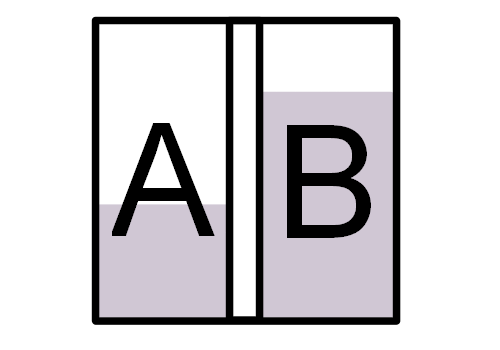

Technologies such as 5G wireless communication transmit data at higher and higher frequencies. One of the major drawbacks of higher frequency signals is the high possibility of signal blockage or interference from walls, windows, and other objects. One possible solution to this problem is an intelligent reflecting surface (IRS). An IRS is a surface with a number of reflective elements that are reconfigurable. This device would theoretically be able to adjust the properties of a signal to make it more easily receivable. My team is currently working on creating an IRS that uses liquid metal in its reflective elements.

For this project I am personally working on the fabrication of the elements that make up our IRS. The configuration of liquid metal inside these elements will determine how the signal is adjusted. For example, in the figure below, the liquid metal in position A would likely produce a different reflection than the liquid metal in position B.

I am also working on the design of a control mechanism for the liquid metal within these elements. This control mechanism will be used to position the liquid metal inside each element. As this research project is currently ongoing, further details regarding the specific implementation of these designs are not available at this time.

From working on this project up to this point I have learned more about using different types of materials and tools such as craft cutters and rotary tools. I have also continued to improve on my teamwork skills and technical writing skills.
