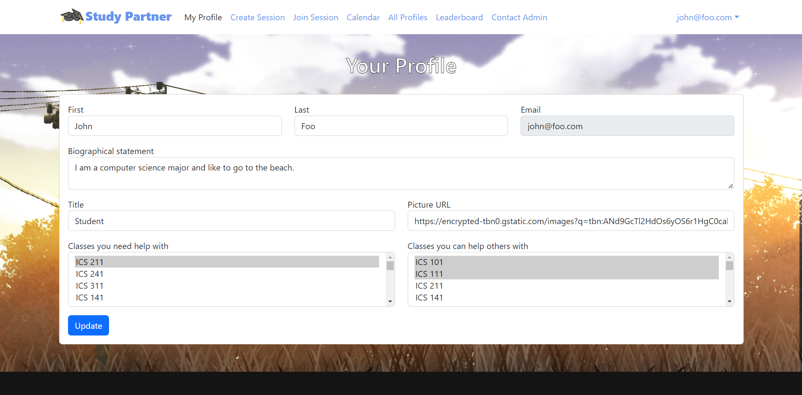

Many computer science students have a difficult time learning their course materials and doing their homework. Students often do not feel comfortable asking for help and instead struggle to complete their assignments alone. Study Partner was my group’s solution to this problem. Study Partner is a web application that allows computer science students to schedule and join study sessions organized by other students. While this application was originally developed for computer science students, it could theoretically be used for any type of students. The application was primarily made with JavaScript and Meteor. 

One of my contributions to this project is the Your Profile page (shown below). From this page, users of the application can add and edit their profile information such as their name, bio, and profile picture. They can also indicate what classes they need help with and what classes they can help other people with. Other users will be able to see this information, which will help students know who they can organize study sessions with for certain classes. 

In addition to the Your Profile page, I also helped contribute to other pages such as the Join Session page and the Create Session page. For these other pages, I primarily helped with fixing bugs. An example of a bug that I fixed is that the Create Session page would create study session objects that have the same id, which would lead to errors in other pages. I was able to fix this by adding code to make sure the id for a study session was unique. I also changed the code that assigns ids to use the size of the study session collection instead of a hardcoded value. 

In terms of project management, I organized our first team meeting, set up the Discord server we used for our communications, and set up the GitHub organization that we used for our code repositories. I also helped with updating our project home page. 

From this project I learned more about the management that goes into working on a longer term project. I learned how to keep all our completed and ongoing tasks organized, so everyone on the team knows what has been completed and what still needs to be done. I also learned more about working in a team environment with people that I did not know previously. I have always understood that I sometimes need to compromise with my teammates and accept their decisions, even if I do not agree with them. Actually putting that idea into practice was a lot more difficult, and is something that I will continue to work on. 

For more information, check out our project's github.io page. This page has links to our project's Github repositories and more detailed information about this project. 

[Link to github.io page](https://study-partner.github.io/)
